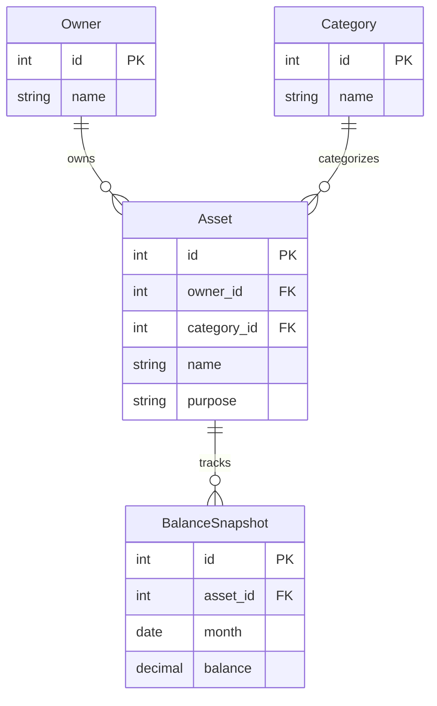

# ER図

家庭資産管理システムのデータモデル

## テーブル説明

| テーブル | 説明 |
|---------|------|
| Owner | 名義人（サンプル太郎、サンプル花子） |
| Category | 資産カテゴリ（現金/銀行/NISA/iDeCo） |
| Asset | 各口座・資産（SBIネット銀行、ゆうちょ銀行等） |
| BalanceSnapshot | 月次の残高記録 |
